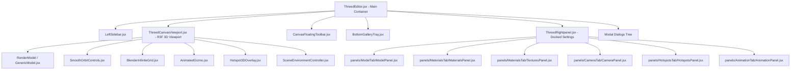

# 3D Editor Architecture & File Mapping Guide

This document maps out the architecture and file structure of the **3D Editor** (`Frontend/src/components/ThreedEditor/`), detailing which features, state logic, and UI components reside in each dedicated file.

---

## 🏗️ High-Level Architecture Overview

---

## 📁 File & Component Directory

### 1. Main Coordinator
* **[`ThreedEditor.jsx`](file:///d:/Sham/Flipibook/Frontend/src/components/ThreedEditor/ThreedEditor.jsx)**
  * Top-level page container and state coordinator.
  * Connects router parameters (`modelId`), undo/redo history stack, global loaders, and modal triggers.
  * Organizes and passes props to the Viewport, Left Sidebar, Bottom Swatch Tray, and Right Settings Panel.

---

### 2. Specialized Custom Hooks (`hooks/`)
* **[`useThreedCameraControls.js`](file:///d:/Sham/Flipibook/Frontend/src/components/ThreedEditor/hooks/useThreedCameraControls.js)**
  * Viewport framing calculations (`frameModelFullView`), zoom in/out steps, camera perspective switching (Perspective, Front, Top, Right, Orthographic), and view reset.
* **[`useThreedHotspots.js`](file:///d:/Sham/Flipibook/Frontend/src/components/ThreedEditor/hooks/useThreedHotspots.js)**
  * Geodesic spherical camera navigation to mesh surface front view (`focusHotspot`).
  * 3D pin placement mode (`isPlacingHotspot`), click detection, surface normal recording, and pin CRUD handlers.
* **[`useThreedMaterialTree.js`](file:///d:/Sham/Flipibook/Frontend/src/components/ThreedEditor/hooks/useThreedMaterialTree.js)**
  * Model part tree resolution (`activeMaterialList`) with recursive group/mesh pruning.
  * Part visibility toggling (`handleToggleVisibility`), X-Ray selection sets (`handleToggleXray`), model deletion (`handleDeleteModel`), material deletion (`handleDeleteMaterial`), and renaming.
* **[`useThreedMaterialSettings.js`](file:///d:/Sham/Flipibook/Frontend/src/components/ThreedEditor/hooks/useThreedMaterialSettings.js)**
  * PBR factor parameter updates (`updateMaterialSetting`), physical color overrides, custom HDR management with IndexedDB persistence (`saved_hdrs`), and manual map uploading (`handleMapUpload`).
* **[`useThreedModelLoader.js`](file:///d:/Sham/Flipibook/Frontend/src/components/ThreedEditor/hooks/useThreedModelLoader.js)**
  * File drag-and-drop ingestion (`processFile`, `handleDrop`), CAD/FBX/Archive format conversion pipelines, gallery model replacements (`handleSelectGalleryModel`), and workspace reset (`handleClearModel`).
* **[`useModalHistory.js`](file:///d:/Sham/Flipibook/Frontend/src/components/ThreedEditor/hooks/useModalHistory.js)**
  * Snapshot-based undo and redo history stack manager with debounced state committing.

---

### 3. 3D Viewport & Scene Elements (`Components/`)
* **[`ThreedCanvasViewport.jsx`](file:///d:/Sham/Flipibook/Frontend/src/components/ThreedEditor/Components/ThreedCanvasViewport.jsx)**
  * Full-bleed React Three Fiber `<Canvas>` containing camera setups, ambient & sun directional lights, background environment, and placement banners.
* **[`GenericModel.jsx`](file:///d:/Sham/Flipibook/Frontend/src/components/ThreedEditor/Components/GenericModel.jsx)**
  * Core Three.js model renderer handling geometry meshes, PBR texture mapping, material overrides, and bounding box centering.
* **[`ModelLoaders.jsx`](file:///d:/Sham/Flipibook/Frontend/src/components/ThreedEditor/Components/ModelLoaders.jsx)**
  * Dispatches file types (`.glb`, `.fbx`, `.obj`, `.stl`, `.step`, `.iges`) to their respective loaders.
* **[`SceneEnvironmentController.jsx`](file:///d:/Sham/Flipibook/Frontend/src/components/ThreedEditor/Components/SceneEnvironmentController.jsx)**
  * Dynamic sun positioning, directional shadows, HDR environment rotation, background blur, and reflection intensity.
* **[`SmoothOrbitControls.jsx`](file:///d:/Sham/Flipibook/Frontend/src/components/ThreedEditor/Components/SmoothOrbitControls.jsx)**
  * Damped orbital navigation, orbit/pan switching, and continuous auto-rotation.
* **[`BlenderInfiniteGrid.jsx`](file:///d:/Sham/Flipibook/Frontend/src/components/ThreedEditor/Components/BlenderInfiniteGrid.jsx)**
  * Procedural horizon-fading infinite grid with integrated XYZ ground axes.
* **[`AnimatedGizmo.jsx`](file:///d:/Sham/Flipibook/Frontend/src/components/ThreedEditor/Components/AnimatedGizmo.jsx)**
  * Interactive 3D coordinate orientation cube/gizmo in the corner of the canvas.
* **[`Hotspot3DOverlay.jsx`](file:///d:/Sham/Flipibook/Frontend/src/components/ThreedEditor/Components/Hotspot3DOverlay.jsx)**
  * Renders HTML billboard pins anchored to 3D surface coordinates with clickable focus cards.

---

### 4. Right Settings Tabs & Panels (`panels/` & `ThreedRightpanel.jsx`)
* **[`ThreedRightpanel.jsx`](file:///d:/Sham/Flipibook/Frontend/src/components/ThreedEditor/ThreedRightpanel.jsx)**
  * Right dock container routing tabs to their corresponding modular panels.
* **[`panels/ModelTab/ModelPanel.jsx`](file:///d:/Sham/Flipibook/Frontend/src/components/ThreedEditor/panels/ModelTab/ModelPanel.jsx)**
  * Model tree list, part hierarchy selection, auto-rotate toggles, grid/axes toggles, and Translate/Rotate/Scale inputs.
* **[`panels/MaterialsTab/MaterialsPanel.jsx`](file:///d:/Sham/Flipibook/Frontend/src/components/ThreedEditor/panels/MaterialsTab/MaterialsPanel.jsx)**
  * Selected mesh thumbnail preview, drawer trigger, color swatches, physical PBR factor sliders (Metallic, Roughness, Opacity, Bump), and UV tile/offset controls.
* **[`panels/MaterialsTab/TexturesPanel.jsx`](file:///d:/Sham/Flipibook/Frontend/src/components/ThreedEditor/panels/MaterialsTab/TexturesPanel.jsx)**
  * PBR texture map slots (Base, Metalness, Roughness, Normal, AO, Bump, Alpha) with upload and clear buttons.
* **[`panels/CameraTab/CameraPanel.jsx`](file:///d:/Sham/Flipibook/Frontend/src/components/ThreedEditor/panels/CameraTab/CameraPanel.jsx)**
  * Field of View (FOV) slider and camera snapshot / screenshot triggers.
* **[`panels/HotspotsTab/HotspotsPanel.jsx`](file:///d:/Sham/Flipibook/Frontend/src/components/ThreedEditor/panels/HotspotsTab/HotspotsPanel.jsx)**
  * 3D pin listing, pin focus selection, editing modal trigger, and pin deletion.
* **[`panels/AnimationTab/AnimationPanel.jsx`](file:///d:/Sham/Flipibook/Frontend/src/components/ThreedEditor/panels/AnimationTab/AnimationPanel.jsx)**
  * Animation clip detector with play/pause playback controls.
* **[`panels/common/PanelInputs.jsx`](file:///d:/Sham/Flipibook/Frontend/src/components/ThreedEditor/panels/common/PanelInputs.jsx)**
  * Shared UI inputs (drag-scrub XYZ inputs, custom range sliders).
* **[`panels/common/XRayToggleBar.jsx`](file:///d:/Sham/Flipibook/Frontend/src/components/ThreedEditor/panels/common/XRayToggleBar.jsx)**
  * X-Ray view mode toggle bar.

---

### 5. UI Toolbars, Drawers & Trays
* **[`LeftSidebar.jsx`](file:///d:/Sham/Flipibook/Frontend/src/components/ThreedEditor/LeftSidebar.jsx)**
  * Left sidebar containing tab buttons (Model, Textures, Materials, Lighting, Camera, Animation) and model rename input.
* **[`CanvasFloatingToolbar.jsx`](file:///d:/Sham/Flipibook/Frontend/src/components/ThreedEditor/CanvasFloatingToolbar.jsx)**
  * Floating pill bar for camera views, wireframe toggle, orbit/pan modes, zoom in/out, view reset, undo/redo, and transform gizmo mode selectors.
* **[`BottomGalleryTray.jsx`](file:///d:/Sham/Flipibook/Frontend/src/components/ThreedEditor/BottomGalleryTray.jsx)**
  * Bottom texture gallery tray with color swatches, texture cards, and add custom material button.
* **[`MaterialSelectorDrawer.jsx`](file:///d:/Sham/Flipibook/Frontend/src/components/ThreedEditor/Components/MaterialSelectorDrawer.jsx)**
  * Flyout drawer with categorized material presets (Wood, Metal, Fabric, Glass, Plastic, etc.).

---

### 6. Modals & Dialogs (`Components/`)
* **[`Export3DModal.jsx`](file:///d:/Sham/Flipibook/Frontend/src/components/ThreedEditor/Components/Export3DModal.jsx)**: Export configuration modal (GLB, OBJ, STL, textures downscaling, Meshopt compression).
* **[`SaveAsModal.jsx`](file:///d:/Sham/Flipibook/Frontend/src/components/ThreedEditor/Components/SaveAsModal.jsx)**: Duplicate / Save As copy dialog.
* **[`HotspotModal.jsx`](file:///d:/Sham/Flipibook/Frontend/src/components/ThreedEditor/Components/HotspotModal.jsx)**: Pin label, description, and color editor.
* **[`AddModelModal.jsx`](file:///d:/Sham/Flipibook/Frontend/src/components/ThreedEditor/Components/AddModelModal.jsx)**: Upload additional model files into the scene.
* **[`ModelGalleryModal.jsx`](file:///d:/Sham/Flipibook/Frontend/src/components/ThreedEditor/Components/ModelGalleryModal.jsx)**: Cloud 3D model library picker.
* **[`CameraModal.jsx`](file:///d:/Sham/Flipibook/Frontend/src/components/ThreedEditor/Components/CameraModal.jsx)**: High-resolution camera snapshot preview and download modal.
* **[`AddMaterial.jsx`](file:///d:/Sham/Flipibook/Frontend/src/components/ThreedEditor/Components/AddMaterial.jsx)**: Custom PBR texture set creator dialog.
* **[`GlobalLoader.jsx`](file:///d:/Sham/Flipibook/Frontend/src/components/ThreedEditor/Components/GlobalLoader.jsx)**: Full-screen animated loading and format conversion indicator.

---

### 7. Export & Save Utilities (`utils/`)
* **[`threedExportHandlers.js`](file:///d:/Sham/Flipibook/Frontend/src/components/ThreedEditor/utils/threedExportHandlers.js)**: `executeExport3D` (GLTFExporter + gltf-transform Meshopt compression) and `captureCameraSnapshot`.
* **[`threedSaveHandlers.js`](file:///d:/Sham/Flipibook/Frontend/src/components/ThreedEditor/utils/threedSaveHandlers.js)**: `executeSave3D` chunked GLB upload and database persistence.
* **[`modelConversionUtils.js`](file:///d:/Sham/Flipibook/Frontend/src/components/ThreedEditor/utils/modelConversionUtils.js)**: CAD and FBX version checks & conversion bridges.
* **[`modelDropHandler.js`](file:///d:/Sham/Flipibook/Frontend/src/components/ThreedEditor/utils/modelDropHandler.js)**: Archive extraction and drag-and-drop parsing.
